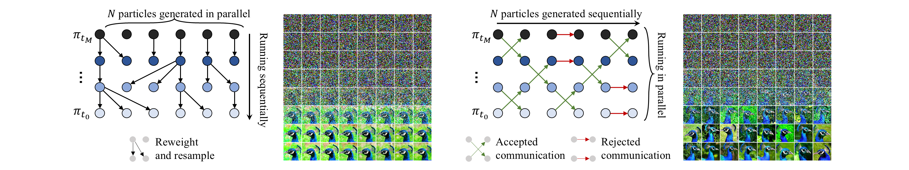
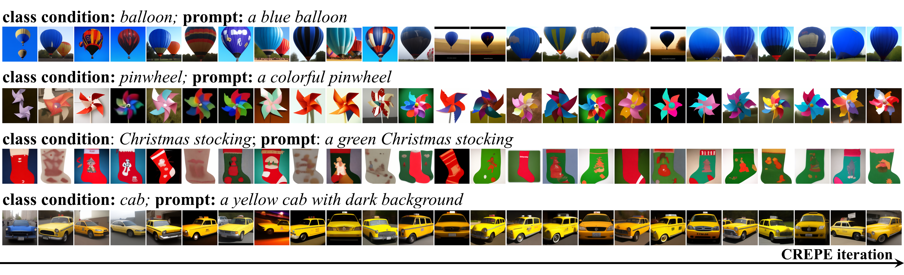

# CREPE🥞: Controlling diffusion with REPlica Exchange

[](https://arxiv.org/abs/2509.23265)

CREPE🥞 is an inference-time control algorithm for diffusion models (both Gaussian diffusion and CTMC!). 


Illustration of CREPE (right) and comparison with SMC control (left):



Example of CREPE for prompted reward-tilting on ImageNet-512:



This repo contains various applications of CREPE:
- [Tempering on Boltzmann distribution of Alanine Di/Tetra/Hexa-peptide](https://github.com/jiajunhe98/CREPE-Controlling-diffusion-with-REPlica-Exchange/tree/main/applications/tempering)
- [Trajectory stitching for maze](https://github.com/jiajunhe98/CREPE-Controlling-diffusion-with-REPlica-Exchange/tree/main/applications/stitching)
- [Debiasing CFG for image generation](https://github.com/jiajunhe98/CREPE-Controlling-diffusion-with-REPlica-Exchange/tree/main/applications/cfg)
- [Prompted reward-tilting for image generation](https://github.com/jiajunhe98/CREPE-Controlling-diffusion-with-REPlica-Exchange/tree/main/applications/reward-tilting)
- Debiasing CFG on CTMC (Coming soon!)

  
The structure is as follows:

```
applications
    ├── tempering
    │        - code for inference-time tempering for Boltzmann sampling
    ├── stitching
    │        - code for stitching trajectories in the maze
    ├── cfg
    │        - debiasing cfg on ImageNet
    ├── reward-tilting
    │        - prompted reward-tilting on ImageNet
    └── ctmc
            - debiasing cfg for CTMC models (🚧under construction, coming soon!)
```
The required environment may differ for each application. Please refer to their own folder.
